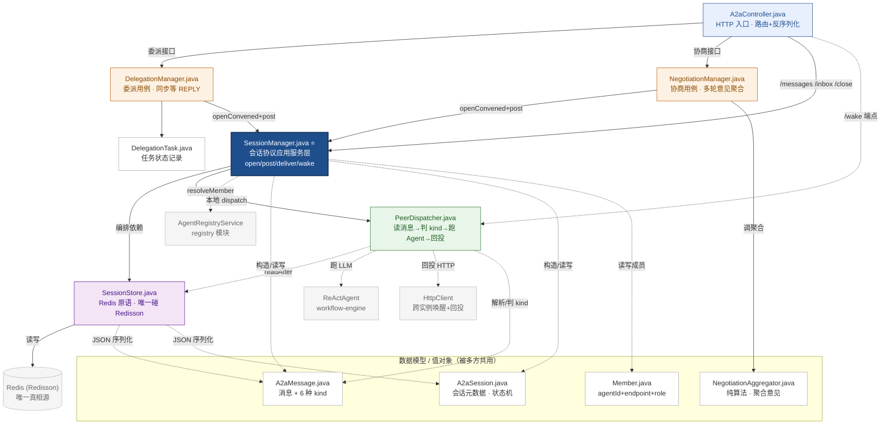

```mermaid
flowchart TD
    CTRL["A2aController.java<br/>HTTP 入口 · 路由+反序列化"]

    DEL["DelegationManager.java<br/>委派用例 · 同步等 REPLY"]
    NEG["NegotiationManager.java<br/>协商用例 · 多轮意见聚合"]
    DTASK["DelegationTask.java<br/>任务状态记录"]

    SM["SessionManager.java ⭐<br/>会话协议应用服务层<br/>open/post/deliver/wake"]
    PD["PeerDispatcher.java<br/>读消息→判 kind→跑 Agent→回投"]
    SS["SessionStore.java<br/>Redis 原语 · 唯一碰 Redisson"]

    subgraph MODELS["数据模型 / 值对象（被多方共用）"]
        MSG["A2aMessage.java<br/>消息 + 6 种 kind"]
        SESS["A2aSession.java<br/>会话元数据 · 状态机"]
        MEM["Member.java<br/>agentId+endpoint+role"]
        AGG["NegotiationAggregator.java<br/>纯算法 · 聚合意见"]
    end

    REG["AgentRegistryService<br/>registry 模块"]
    REDIS[("Redis (Redisson)<br/>唯一真相源")]
    REACT["ReActAgent<br/>workflow-engine"]
    HTTP["HttpClient<br/>跨实例唤醒+回投"]

    %% 主链
    CTRL -->|委派接口| DEL
    CTRL -->|协商接口| NEG
    CTRL -->|/messages /inbox /close| SM
    CTRL -.->|/wake 端点| PD

    DEL --> DTASK
    DEL -->|openConvened+post| SM
    NEG -->|openConvened+post| SM
    NEG -->|调聚合| AGG

    SM -->|编排依赖| SS
    SM -->|本地 dispatch| PD
    PD -.->|readAfter| SS
    SS -->|读写| REDIS

    %% 外部依赖
    SM -.->|resolveMember| REG
    PD -.->|跑 LLM| REACT
    PD -.->|回投 HTTP| HTTP

    %% 数据模型协作
    SM -.->|构造/读写| MSG
    SM -.->|构造/读写| SESS
    SM -.->|读写成员| MEM
    SS -.->|JSON 序列化| MSG
    SS -.->|JSON 序列化| SESS
    PD -.->|解析/判 kind| MSG

    classDef core fill:#1f4e8c,stroke:#0d2c54,color:#fff,stroke-width:2px;
    classDef entry fill:#e8f0fe,stroke:#1f4e8c,color:#1f4e8c;
    classDef usecase fill:#fdf1e3,stroke:#c2620c,color:#8a4b00;
    classDef exec fill:#e8f5e9,stroke:#2e7d32,color:#1b5e20;
    classDef store fill:#f3e5f5,stroke:#6a1b9a,color:#4a148c;
    classDef model fill:#ffffff,stroke:#aaa,color:#333;
    classDef external fill:#f5f5f5,stroke:#bbb,color:#666;

    class SM core;
    class CTRL entry;
    class DEL,NEG usecase;
    class PD exec;
    class SS store;
    class MSG,SESS,MEM,DTASK,AGG model;
    class REG,REDIS,REACT,HTTP external;
```
