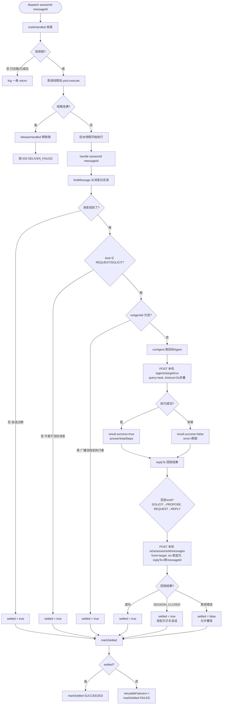
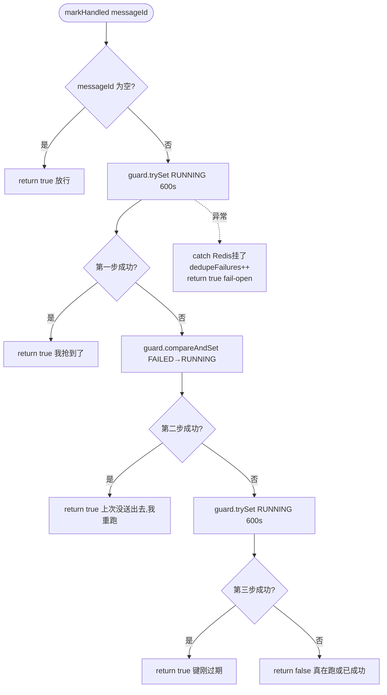

# 整体定位

是 FlowAgent 中 A2A 会话体系的任务执行派发器。

它的核心职责是：

1.接收投递过来的会话消息

2.筛选出需要目标 Agent 实际执行的消息

3.在独立线程池中调用目标 Agent 完成任务

4.最终将执行结果通过 HTTP 接口回写到原会话中，形成完整的 “请求 - 应答” 闭环。

# 流程图



markHandled 抢锁的三步



# 三个核心设计目标

1.防循环：Agent 消息循环 + 组件依赖循环

2.幂等性保障：同一条消息无论被投递多少次，保证只被执行一次

3.故障隔离与可观测：执行逻辑与投递逻辑解耦，异常不扩散，故障类型可被精准监控

## 防止 Agent 间循环调用

可执行消息白名单如下：

```java
private static final Set<A2aMessage.MessageKind> EXECUTABLE_KINDS =
        EnumSet.of(A2aMessage.MessageKind.REQUEST, A2aMessage.MessageKind.SOLICIT);
```

由此可见，仅 REQUEST（委派任务）、SOLICIT（征询意见） 两种消息会触发实际执行 -- 这两类都要对方 Agent 运行推理后才能给答复。

执行完成后回投的回复消息不在可执行集合里，链路到此自动终止，不会出现 Agent 消息循环。

## 防止组件循环依赖

回写走 HTTP 而非直接注入：

先来看一下二者分别可以如何实现：

```java
//直接注入就是往 PeerDispatcher 的构造器里加一个参数
public PeerDispatcher(SessionStore store, SessionManager sessionManager, ...) {
    this.sessionManager = sessionManager;
}
//这样回写就成了一个普通的 Java 方法调用
private boolean replyTo(...) {
    A2aMessage reply = A2aMessage.builder()....build();
    sessionManager.post(sessionId, reply);   // 同一个 JVM 里的方法调用
    return true;
}
//同一个线程，直接进 SessionManager.post()的方法体
//参数是已经构造好的对象（不是 JSON）
//异常是原样的 Java 异常往上抛，没有任何序列化、网络、超时、签名。
```

```java
//把「写消息」这件事换成了「向http://localhost:8080/a2a/sessions/{id}/messages 发一个POST」
//具体回写路径
A2aMessage reply=A2aMessage.builder()
        .fromAgentId(target).toAgentId(request.getFromAgentId())
        .kind(replyKind).replyTo(request.getMessageId()).payload(result)
        .build();
post("/a2a/sessions/" + sessionId + "/messages", toBody(reply), dispatchTimeoutSeconds, sessionId);
//toBody() 把 A2aMessage 拍成一个 Map（null字段不发，让服务端补默认）——因为 HTTP 上没有类型，只能传 JSON。

//然后进post()：
String payload = JsonUtil.toJson(body);          // 序列化一次
HttpRequest.Builder builder = HttpRequest.newBuilder()
        .uri(URI.create(localBaseUrl + path))     // 本机地址
        .header("Content-Type", "application/json")
        .POST(HttpRequest.BodyPublishers.ofString(payload))
        .timeout(Duration.ofSeconds(timeoutSeconds));
signature.headersFor(scope, payload).forEach(builder::header);   // HMAC签名头
HttpResponse<String> response = httpClient.send(builder.build(),
        HttpResponse.BodyHandlers.ofString());
//请求打出去之后，本实例的 A2aController 收到它、当作一个普通的外部调用者处理
```

当 PeerDispatcher 执行完任务、需要把回复写回会话时，如果直接注入 SessionManager，调用它的 `post()` / `deliver()` 方法把回复消息发出去，这时 PeerDispatcher 就必须依赖 SessionManager 了。

两个类互相持有对方的引用、互相依赖对方的方法，这就是典型的循环依赖。

它带来的问题有：

1.在 Spring 等依赖注入容器中，构造器注入的循环依赖会直接导致应用启动失败；即使使用字段注入绕过初始化，也会带来代理失效、初始化顺序异常等隐患。

2.这会打破「消息只能通过会话 API 写入会话」的架构约束。PeerDispatcher 相当于拿到了 “后门”，可以绕开 SessionManager 层的签名校验、配额预算、审计日志等逻辑直接写消息，破坏了会话写入的统一管控。

**为什么走 HTTP 就能避免组件循环依赖**

走 HTTP 调用本实例的 `/a2a/sessions/{id}/messages` 接口，本质是用公开 API 层把反向依赖解耦：

PeerDispatcher 不再直接持有 SessionManager 对象，只依赖通用的 HttpClient 和本地地址配置

反向的 “写消息” 操作，和外部调用者走完全相同的公开接口，经过完整的校验、审计、预算控制

## 分布式幂等去重机制

基于 Redis 实现分布式幂等闸

三种状态定义

| 状态 | 含义 | 重放行为 |
| ---- | ---- | ---- |
| RUNNING | 已认领、正在执行中，未到终态 | 拦截重复投递，不允许抢执行权 | 
| SUCCEEDED | 执行完成且回复已送达（无论业务成功失败） | 永久拒绝重新投递，禁止抢执行权 |
| FAILED | 执行完成但投递回复失败 | 允许重新投递请求，可抢回执行权（只做重试投递回复） |

markHandled()：标明"这条消息由我接手" 

三步设计完全规避竞态窗口：

```java
private boolean markHandled(String messageId) {
    if (messageId == null) {
        // 没有 id 就没有去重的依据。放行而不是拦住：拦住等于把一条正常消息丢掉
        return true;
    }
    try {
        RBucket<String> guard = redissonClient.getBucket(
                CacheConstants.A2A_SESSION_HANDLED + messageId);
        if (guard.trySet(RUNNING, handledTtlSeconds, TimeUnit.SECONDS)) {
            return true;
        }
        if (guard.compareAndSet(FAILED, RUNNING)) {
            return true;
        }
        return guard.trySet(RUNNING, handledTtlSeconds, TimeUnit.SECONDS);
    } catch (Exception e) {
        long n = dedupeFailures.incrementAndGet();
        if (n == 1 || n % 100 == 0) {
            // 计数逐次，日志限流（与 CostTracker#record 同一写法）
            log.warn("[A2A] 幂等闸读不到，本次放行不做去重 | 累计 {} 次 | message={} | error={}",
                    n, messageId, e.toString());
        }
        return true;
    }
}
```

第一步 trySet(RUNNING):

如果键不存在（没人认领过）或已过期，直接设置为 `RUNNING` 并写入 TTL，抢到则返回 true。

用 `trySet` 而非 `get+set`：避免两步之间的竞态窗口，防止并发重放（多条重复消息几乎同一时刻并发到达）同时读到 null。

值与 TTL 一次原子写入：避免 `set+expire` 分两次命令产生时间窗口。

第二步 compareAndSet(FAILED, RUNNING):

如果上一次执行完但回复没送达（状态为 FAILED），允许抢回执行权重新投递回复。

直接使用 CAS，不用先 get 再判断，减少一次 Redis 往返，同时避免读到的值在判断时过期。

第三步 再次 trySet(RUNNING)：只处理 “第一步返回 false、到第二步之间 TTL 恰好到期” 的极端边界场景。

## 关键设计细节

1.TTL约束：

`handledTtlSeconds` 必须大于 `dispatchTimeoutSeconds`（默认是 10 倍），
否则标记会在执行还没结束时过期，重放就能挤进来跑第二遍，闸门直接失效。

2.Fail-Open 降级策略：

Redis 异常时不阻断执行，直接放行但累计计数。如果 Redis 抖动就停止干活，会导致大量委派变成永久死消息。配套 `dedupeFailures` 计数器：专门记录放行次数

3.Redis 幂等闸门的 Key：

常规分布式消息框架一般采用 `sessionId + messageId` 组合键：目的是将相同 messageId、不同会话的消息视作两条独立消息，相互隔离互不干扰，用会话 + 消息 ID 联合唯一标识一条会话消息。

但 PeerDispatcher 做了简化：直接使用messageId 单独作为幂等 Key，不再拼接 sessionId。
理由：只有`REQUEST`类型消息才会进入 PeerDispatcher 执行。REQUEST 消息携带`toAgent`，代表这条消息是定向投递给单个 Agent，不属于广播消息。不存在一条消息同时发给多个 Agent 的场景，也就不会出现经典陷阱：第一个 Agent 处理完成写入 Redis 标记，后续其他 Agent 拿到同一个 messageId，误判消息已处理而直接跳过执行。

## markSettled()：终态写入

用 compareAndSet(RUNNING, state) 而非直接 set：

可能出现 "执行超时 -> 重投抢回并跑完（这里的重投是靠外部发起的） -> 旧执行回头写终态" 的场景，无条件 set
会覆盖新一轮的 RUNNING 状态

CAS 以 “自己还在 RUNNING” 为条件，迟到的旧执行者静默退场，不影响新执行。

不顺手刷新 TTL：沿用认领时的 TTL，避免 `compareAndSet+expire` 两条命令之间产生 
“状态已是终态、TTL 已到期” 的窗口。

Redis 异常只打 WARN 日志、不向上抛出：执行已经结束，不能因为标记失败把业务结果变成异常。

releaseHandled()：标记释放

线程池拒绝任务时，必须删除已认领的标记，否则这条消息会被永久标记为 “已处理”，变成再也不会被执行的死消息。

## 线程池设计

```java
this.pool = new ThreadPoolExecutor(
        2, 8, 60L, TimeUnit.SECONDS,
        new ArrayBlockingQueue<>(200),
        r -> {
            Thread t = new Thread(r, "a2a-peer-" + seq.incrementAndGet());
            t.setDaemon(true);
            return t;
        },
        new ThreadPoolExecutor.AbortPolicy());
```

池隔离：与协商场景的线程池分开。协商是 “一轮并发问 N 个 Agent 然后全部等回”，本池是 “后台把一件委派做完”；
合成一个池会导致大量协商任务挤掉委派任务。

拒绝策略为 AbortPolicy：
队列满说明并发委派已超载，如果用 `CallerRunsPolicy` 
让调用线程（发起方的 POST 请求线程）去跑 Agent，会把发起方阻塞几十秒。

有界队列 200：做流量削峰，应对瞬时突刺，不会直接拒绝。

守护线程：不阻塞 JVM 正常退出

## 主处理流程

**dispatch()：入口方法**

接收消息、准备派发的那个调用方线程（主线程）先做幂等检查，检查通过之后，才把任务丢进线程池，而不是在每个子线程执行任务前检查一遍

提交失败的处理：线程池满时，先释放幂等标记，再抛出 `DELIVER_FAILED` 异常（503），不能让一次过载变成永久死消息。

立即返回：AgentA（投递方）发 HTTP 请求，把会话消息推给 AgentB 的 PeerDispatcher。B 把任务丢进内部线程池后，立刻 HTTP 响应返回给 AgentA：`200 OK / 接收成功`

**handle()：核心处理逻辑**

返回值是 settled（是否终态），而非 "业务成功与否"。

消息读不到，settled=true，重投也读不到

消息类型不在可执行集合 → `settled=true`，本就不该执行

广播消息无指定执行者 → `settled=true`，重投也还是没有执行者

**runAgent()：执行目标 Agent**

调用本进程的 `POST /agents/{agentId}/run` 端点，复用现有 Agent 执行入口，不重复实现一套执行逻辑。

原样传递调用方的业务 `context`，追加 `a2a.delegationDepth` 委派深度，用于限制调用链长度，防止无限嵌套委派。

异常兜底：任何执行失败都封装成 `success=false` 的结构化结果返回，而不是向外抛异常

**replyTo()：回写结果到会话**

根据请求类型自动推导回复类型。

回复成功送达 → `settled=true`，无论业务成败

会话已关闭（`SESSION_CLOSED`）→ `settled=true`，会话不会复活，重投无意义

其他投递失败（网络抖动、网关重启等）→ `settled=false`，标记为 FAILED，允许上游重投

## 监控与可观测性

两个独立计数器，分开统计，对应两种完全不同的故障方向：

dedupeFailures：幂等闸失效（Redis 异常）放行的累计次数，持续增长说明 Redis 链路有问题

retryableFailures：执行完成但回复投递失败、标记为 FAILED 的累计次数，持续增长说明回写链路有问题
