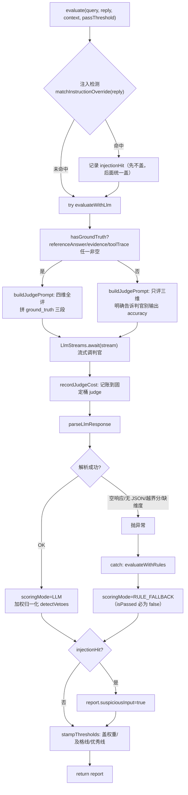

# LlmJudge

## 流程图

```mermaid
flowchart TD
    A["evaluate(query, reply, context, passThreshold)"] --> B{"注入检测<br/>matchInstructionOverride(reply)"}
    B -->|命中| C["记录 injectionHit（先不盖，后面统一盖）"]
    B -->|未命中| D
    C --> D
    D["try evaluateWithLlm"] --> E["hasGroundTruth?<br/>referenceAnswer/evidence/toolTrace 任一非空"]
    E -->|是| F["buildJudgePrompt: 四维全评<br/>拼 ground_truth 三段"]
    E -->|否| G["buildJudgePrompt: 只评三维<br/>明确告诉判官别输出 accuracy"]
    F --> H["LlmStreams.await(stream) 流式调判官"]
    G --> H
    H --> I["recordJudgeCost: 记账到固定桶 judge"]
    I --> J["parseLlmResponse"]
    J --> K{"解析成功?"}
    K -->|空响应/无 JSON/越界分/缺维度| L["抛异常"]
    K -->|OK| M["scoringMode=LLM<br/>加权归一化 detectVetoes"]
    L --> N["catch: evaluateWithRules"]
    N --> O["scoringMode=RULE_FALLBACK<br/>（isPassed 必为 false）"]
    M --> P{"injectionHit?"}
    O --> P
    P -->|是| Q["report.suspiciousInput=true"]
    P -->|否| R["stampThresholds: 盖权重/及格线/优秀线"]
    Q --> R
    R --> S["return report"]
```

## 

## 
