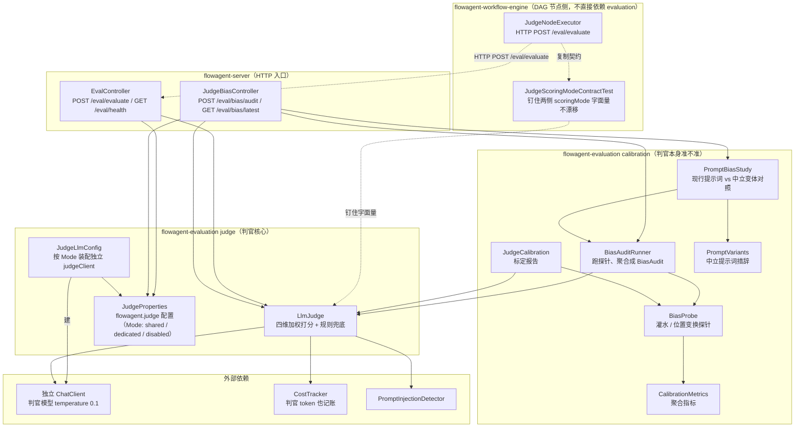

# LLM-as-Judge

## 流程图

```mermaid
graph TD
    subgraph ENGINE["flowagent-workflow-engine（DAG 节点侧，不直接依赖 evaluation）"]
        JNE["JudgeNodeExecutor<br/>HTTP POST /eval/evaluate"]
        CONTRACT["JudgeScoringModeContractTest<br/>钉住两侧 scoringMode 字面量不漂移"]
    end

    subgraph SERVER["flowagent-server（HTTP 入口）"]
        EVALC["EvalController<br/>POST /eval/evaluate / GET /eval/health"]
        BIASC["JudgeBiasController<br/>POST /eval/bias/audit / GET /eval/bias/latest"]
    end

    subgraph CORE["flowagent-evaluation judge（判官核心）"]
        LLMJ["LlmJudge<br/>四维加权打分 + 规则兜底"]
        PROPS["JudgeProperties<br/>flowagent.judge 配置（Mode: shared / dedicated / disabled）"]
        CFG["JudgeLlmConfig<br/>按 Mode 装配独立 judgeClient"]
    end

    subgraph CALIB["flowagent-evaluation calibration（判官本身准不准）"]
        RUNNER["BiasAuditRunner<br/>跑探针、聚合成 BiasAudit"]
        PROBE["BiasProbe<br/>灌水 / 位置变换探针"]
        STUDY["PromptBiasStudy<br/>现行提示词 vs 中立变体对照"]
        JCAL["JudgeCalibration<br/>标定报告"]
        VARIANTS["PromptVariants<br/>中立提示词措辞"]
        METRICS["CalibrationMetrics<br/>聚合指标"]
    end

    subgraph EXT["外部依赖"]
        JUDGE_CLIENT["独立 ChatClient<br/>判官模型 temperature 0.1"]
        COST["CostTracker<br/>判官 token 也记账"]
        INJ["PromptInjectionDetector"]
    end

    JNE -.->|HTTP POST /eval/evaluate| EVALC
    JNE -.->|复制契约| CONTRACT
    CONTRACT -.->|钉住字面量| LLMJ

    EVALC --> LLMJ
    EVALC --> PROPS
    BIASC --> LLMJ
    BIASC --> PROPS
    BIASC --> RUNNER
    BIASC --> STUDY

    CFG --> PROPS
    CFG -->|建| JUDGE_CLIENT
    LLMJ --> JUDGE_CLIENT
    LLMJ --> COST
    LLMJ --> INJ

    RUNNER --> LLMJ
    RUNNER --> PROBE
    STUDY --> RUNNER
    STUDY --> VARIANTS
    JCAL --> LLMJ
    JCAL --> PROBE
    PROBE --> METRICS
```
