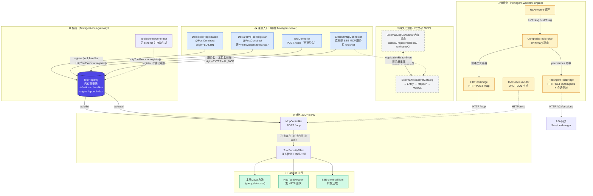

```mermaid
graph TB
    subgraph 注册侧["📥 注册入口（都在 flowagent-server）"]
        direction TB
        R1["DemoToolRegistration<br/>@PostConstruct<br/>origin=BUILTIN"]
        R2["DeclarativeToolRegistrar<br/>@PostConstruct<br/>读 yml flowagent.tools.http.*"]
        R3["ToolController<br/>POST /tools（网页导入）"]
        R4["ExternalMcpConnector<br/>连外部 SSE MCP 服务<br/>拉 tools/list"]
    end

    subgraph 枢纽["⚙️ 枢纽（flowagent-mcp-gateway）"]
        TR[("ToolRegistry<br/>内存四张表<br/>definitions / handlers<br/>origins / groupIndex")]
        SC["ToolSchemaGenerator<br/>无 schema 时自动生成"]
    end

    subgraph 持久化["💾 持久化边界（仅外部 MCP）"]
        CAT["ExternalMcpServerCatalog<br/>→ Entity → Mapper → MySQL"]
        CONN["ExternalMcpConnector 内存状态<br/>clients / registeredTools / rawNameOf"]
    end

    subgraph 对外["🌐 对外 JSON-RPC"]
        MC["McpController<br/>POST /mcp"]
        SEC["ToolSecurityFilter<br/>注入检测 + 敏感门禁"]
    end

    subgraph 消费侧["🔁 消费侧（flowagent-workflow-engine）"]
        RA["ReActAgent 循环"]
        CTB["CompositeToolBridge<br/>@Primary 路由"]
        HTB["HttpToolBridge<br/>HTTP POST /mcp"]
        PATB["PeerAgentToolBridge<br/>HTTP GET /a2a/agents<br/>+ 会话委派"]
        TNE["ToolNodeExecutor<br/>DAG TOOL 节点"]
    end

    subgraph 执行["⚡ Handler 执行"]
        H1["本地 Java 方法<br/>(query_database)"]
        H2["HttpToolExecutor<br/>发 HTTP 请求"]
        H3["SSE client.callTool<br/>转发远端"]
    end

    %% 注册 → 枢纽
    R1 -->|"register(tool, handler, BUILTIN)"| TR
    R2 -->|"HttpToolExecutor.register()"| TR
    R3 -->|"HttpToolExecutor.register()"| TR
    R4 -->|"服务名__工具名前缀<br/>origin=EXTERNAL_MCP"| TR
    SC -.->|"register 时被动触发"| TR

    %% 持久化
    CONN <-->|"名册落库=重启恢复"| CAT
    R4 -.->|"ApplicationReadyEvent<br/>读名册重连"| CAT

    %% 枢纽 → 对外
    TR -->|"tools/list"| MC
    TR -->|"tools/call"| MC
    MC -->|"① 查存在 ② 过门禁 ③ call()"| SEC
    SEC --> H1
    SEC --> H2
    SEC --> H3

    %% 消费侧
    RA -->|"listTools() / callTool()"| CTB
    CTB -->|"普通工具路由"| HTB
    CTB -->|"peerNames 命中"| PATB
    HTB -.->|"HTTP /mcp"| MC
    PATB -.->|"HTTP /a2a/sessions"| A2A["A2A 网关<br/>SessionManager"]
    TNE -.->|"HTTP /mcp"| MC

    %% 样式
    classDef hub fill:#4F46E5,color:#fff,stroke:#312E81,stroke-width:2px
    classDef reg fill:#DBEAFE,stroke:#2563EB
    classDef consumer fill:#FEF3C7,stroke:#D97706
    classDef exec fill:#D1FAE5,stroke:#059669
    classDef persist fill:#F3F4F6,stroke:#6B7280,stroke-dasharray: 5 5
    class TR hub
    class R1,R2,R3,R4 reg
    class RA,CTB,HTB,PATB,TNE consumer
    class H1,H2,H3 exec
    class CAT,CONN persist
```
