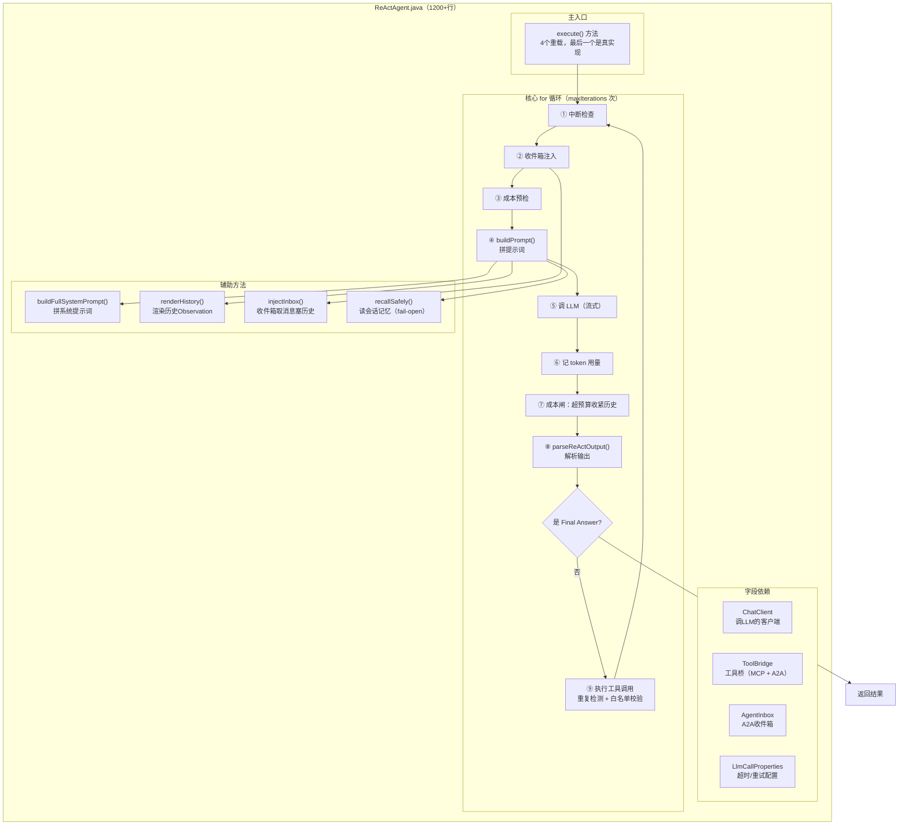
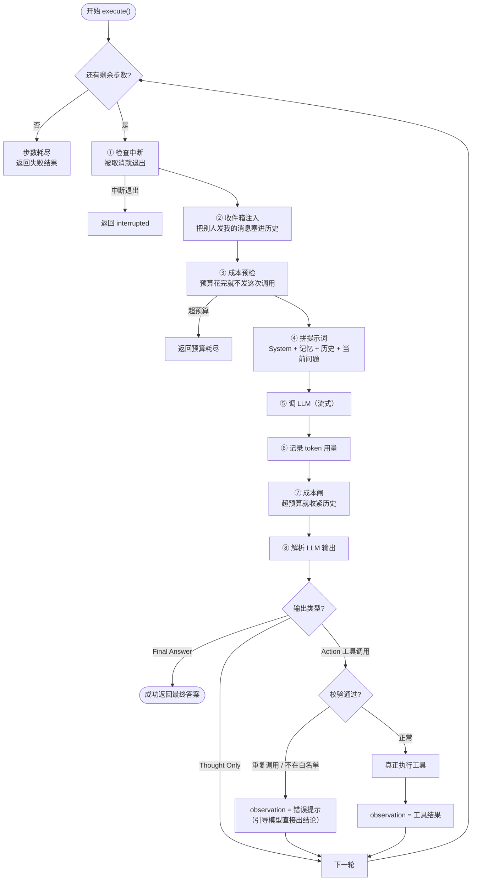

# ReActAgent

## 整体结构



## 核心主循环流程



## ReAct 主循环调度 -- execute()

```java
public ReActResult execute(String systemPrompt, String userQuery, Map<String, Object> context, int maxIterations, ReActCallbacks callbacks, Set<String> allowedTools, HistoryPolicy historyPolicy, AgentMemory memory) {
    Instant startTime=Instant.now();
    List<ReActStep> steps=new ArrayList<>();
    HistoryPolicy policy=historyPolicy != null ? historyPolicy : HistoryPolicy.FULL;
    List<AgentMemory.Turn> memoryTurns=recallSafely(memory);

    log.info("[ReAct] starting | maxIterations={} | memoryTurns={} | query={}", maxIterations, memoryTurns.size(), truncate(userQuery, 100));
    try {
        for (int iteration = 0; iteration < maxIterations; iteration++) {
            if (Thread.currentThread().isInterrupted()) {
                log.warn("[ReAct] interrupted by engine | iterations={} | steps={}",
                        iteration, steps.size());
                return interruptedResult(steps, startTime, callbacks);
            }

            log..debug("[ReAct] iteration {}/{}", iteration + 1, maxIterations);
            // 收件箱：把别人跟我说过、而我没看见的消息补进历史
            // 放在这一轮 buildPrompt 之前，下一段的渲染就自然带上了 —— 不需要
            // 另建一条通道，也不需要动循环本身。见 AgentInbox 的 javadoc。
            if (injectInbox(steps, context, iteration)) {
                return interruptedResult(steps, startTime, callbacks);
            }
            // 前置成本闸
            if (callbacks!=null && !callbacks.beforeLlmCall(iteration)) {
                log.warn("[ReAct] 成本预算已耗尽，终止推理 | iteration={} | steps={}",
                        iteration, steps.size());
                return ReActResult.costBudgetExhausted(steps,
                        Duration.between(startTime, Instant.now()).toMillis());
            }
            // 构建 prompt（System + 会话记忆 + History + 当前 Query）
            Prompt prompt = buildPrompt(systemPrompt, userQuery, steps,
                    iteration == 0, allowedTools, policy, memoryTurns);
            //调用 LLM（流式）
            Instant llmStart=Instant.now();
            ChatResponse response=LlmStreams.await(
                    () -> chatClient.prompt(prompt).stream().chatResponse(),
                    llmCalls, "ReActAgent");
            String llmOutput=response.getResult().getOutput().getText();
            long llmDurationMs = Duration.between(llmStart, Instant.now()).toMillis();

            //提取 tokn 用量与模型名（供成本核算 / 全链路追踪使用）
            ChatResponseMetadata meta = response.getMetadata();
            Usage usage = meta != null ? meta.getUsage() : null;
            int promptTokens = usage != null && usage.getPromptTokens() != null
                    ? usage.getPromptTokens() : 0;
            int completionTokens = usage != null && usage.getCompletionTokens() != null
                    ? usage.getCompletionTokens() : 0;
            String model = meta != null && meta.getModel() != null ? meta.getModel() : "unknown";

            log.debug("[ReAct] LLM output ({}ms, {}/{} tokens, {}):\n{}",
                    llmDurationMs, promptTokens, completionTokens, model, truncate(llmOutput, 500));
            //回调：记录 LLM 调用（含 token 用量与模型）
            if (callbacks != null) {
                callbacks.onLlmCall(llmOutput, llmDurationMs, promptTokens, completionTokens, model);
            }
            //成本闸
            if (policy.isBudgetExceeded(promptTokens)) {
                if (policy.atFloor()) {
                    log.warn("[ReAct] prompt token 预算耗尽且历史已收紧到下限，终止推理"
                                    + " | promptTokens={} | budget={} | policy={} | steps={}",
                            promptTokens, policy.getPromptTokenBudget(), policy, steps.size());
                    if (callbacks != null) {
                        callbacks.onBudgetExhausted(promptTokens, policy);
                    }
                    // 刻意不调 onComplete：预算耗尽是失败终态，发 AGENT_COMPLETE 是在撒谎
                    return ReActResult.budgetExhausted(steps,
                            Duration.between(startTime, Instant.now()).toMillis());
                }

                HistoryPolicy tightened = policy.escalate();
                log.warn("[ReAct] prompt tokens {} 超出预算 {}，收紧历史策略"
                                + " | window {}→{} | maxObsChars {}→{}",
                        promptTokens, policy.getPromptTokenBudget(),
                        policy.getWindowSize(), tightened.getWindowSize(),
                        policy.getMaxObservationChars(), tightened.getMaxObservationChars());
                if (callbacks != null) {
                    callbacks.onHistoryEscalated(promptTokens, policy, tightened);
                }
                policy = tightened;
            }
        }
    }
}
```
