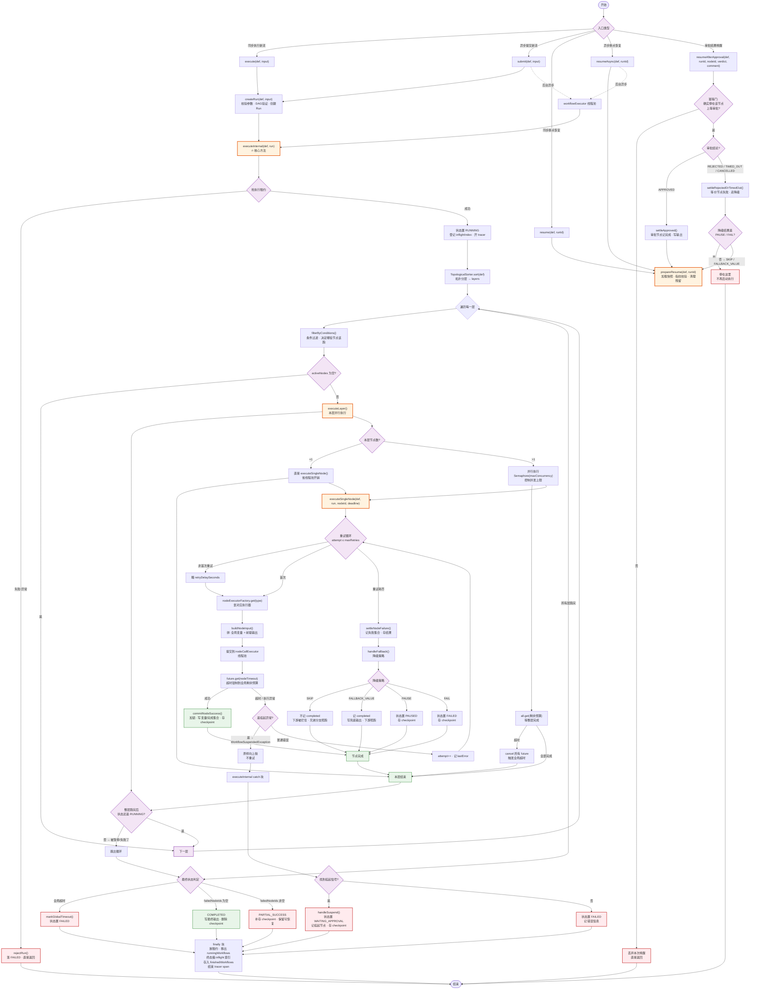

# WorkflowEngine

## 定位

它负责一件事：拿到一张 DAG 工作流定义 + 输入参数，怎么一层一层把节点跑完，中间出问题了怎么重试、降级、挂起、断点续跑

## 核心流程



## 一层怎么并行跑 -- executeLayer()

```java
private void executeLayer(WorkflowDefinition def, WorkflowRun run, List<String> nodeIds, Deadline deadline) {
    if (deadline.expired()) {
        markGlobalTimeout(def, run);
        return;
    }

    if (nodeIds.size()==1) {
        executeSingleNode(def, run, nodeIds.get(0), deadline);
        return;
    }

    // 并发闸门：同一时刻最多 maxConcurrency 个节点执行
    // 层内节点数可能远大于该值，超出的在此排队
    int maxConcurrency=Math.max(1, def.getConfig().getMaxConcurrency());
    Semaphore permits=new Semaphore(maxConcurrency);
    log.debug("[Executor] layer concurrency gate | runId={} | nodes={} | maxConcurrency={}", run.getRunId(), nodeIds.size(), maxConcurrency);
    // Void表示任务返回结果
    List<CompletableFuture<Void>> futures=new ArrayList<>();
    for (String nodeId : nodeIds) {
        // runAsync：不传 Executor，使用默认线程池，这里使用的是 layerExecutor 线程池
        // runAsync(Runnable, Executor)，第一个参数传的是 Runnable 实例
        futures.add(CompletableFuture.runAsync(
                // wrap() 捕获当前主线程的 ThreadLocal，当任务在 layerExecutor 的子线程执行时，把捕获到的上下文重新塞到子线程的 ThreadLocal。
                FlowAgentContext.wrap(() -> {
                    try {
                        permits.acquire();
                    } catch (InterruptedException ie) {
                        Thread.currentThread().interrupt();
                        throw new CompletionException(ie);
                    }
                    try {
                        executeSingleNode();
                    } finally {
                        permits.release();
                    }
                }),
                layerExecutor));
    }

    // 先转成数组，符合参数规范
    // 采用 allOf 策略
    // 这行代码不是阻塞的，allOf 只是注册组合监听，立刻返回，主线程继续往下跑
    // allOf 是异步任务组合器，它本身也是一个异步操作，所以它返回的结果也必须是 CompletableFuture
    CompletableFuture<Void> all=CompletableFuture.allOf(futures.toArray(new CompletableFuture[0]));
    try {
        if (deadline.unlimited()) {
            all.join();
        } else {
            //带超时阻塞等待这批节点任务全部完成
            all.get(Math.max(1, deadline.remainingSeconds()), TimeUnit.SECONDS);
        }
    } catch (TimeoutException te) {
        //全局超时：放弃等待本层，把工作流置为失败
        futures.forEach(f -> f.cancel(true));
        markGlobalTimeout(def, run);
    } catch (InterruptedException ie) {
        futures.forEach(f -> f.cancel(true));
        Thread.currentThread().interrupt();
        throw new CompletionException(ie);
    } catch (ExecutionException ee) {
        // 单节点的异常已在 executeSingleNode 内部消化（重试/降级），
        // 能冒到这里的是编排层自身的异常，不应被吞掉
        throw new CompletionException(ee.getCause() == null ? ee : ee.getCause());
    }
}
```

## 单个节点的完整生命周期 -- executeSingleNode()

```java
public void executeSingleNode(WorkflowDefinition def, WorkflowRun run, String nodeId, Deadline deadline) {
    WorkflowNode node=def.getNode(nodeId);
    WorkflowRun.NodeExecutionResult result=WorkflowRun.NodeExecutionResult.builder().
            .nodeId(nodeId)
            .nodeName(node.getName())
            .status(WorkflowRun.NodeExecutionResult.NodeStatus.RUNNING)
            .startedAt(Instant.now())
            .build();
    run.getActiveNodeIds().add(nodeId);
    run.addTimelineEvent("NODE_START", nodeId, "开始执行: " + node.getName());
    log.info("[Executor] node start | runId={} | node={} | type={}",
            run.getRunId(), nodeId, node.getNodeType());

    int attempt=0;
    Exception lastError=null;

    while (attempt <= node.getMaxRetries()) {
        try {
            if (attempt>0) {
                log.info("[Executor] node retry {}/{} | runId={} | node={}",
                        attempt, node.getMaxRetries(), run.getRunId(), nodeId);
                Thread.sleep(node.getRetryDelaySeconds() * 1000L);
            }

            // 获取节点执行器
            NodeExecutor executor=nodeExecutorFactory.get(node.getNodeType());
            Map<String, Object> nodeOutput;
            try {
                nodeOutput=future.get(nodeTimeout, TimeUnit.SECONDS);
            } catch (TimeoutException e) {
                future.cancel(true);
                throw new FlowAgentException("NODE_TIMEOUT",
                        "节点 " + node.getName() + " 执行超时 (" + nodeTimeout + "s)");
            } catch (ExecutionException e) {
                Throwable cause
            }
        }
    }
}
```

