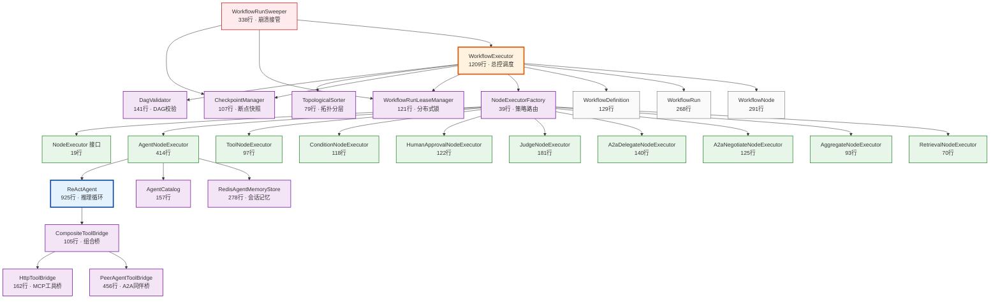

```mermaid
graph TD
    %% 样式定义
    classDef core fill:#e3f2fd,stroke:#1976d2,stroke-width:2px
    classDef scheduler fill:#fff3e0,stroke:#f57c00,stroke-width:2px
    classDef executor fill:#e8f5e9,stroke:#388e3c,stroke-width:1.5px
    classDef support fill:#f3e5f5,stroke:#7b1fa2,stroke-width:1.5px
    classDef model fill:#fafafa,stroke:#616161,stroke-width:1px
    classDef peripheral fill:#ffebee,stroke:#c62828,stroke-width:1.5px

    %% 核心调度层
    WE["WorkflowExecutor<br/>1209行 · 总控调度"]:::scheduler

    %% DAG 层
    DV["DagValidator<br/>141行 · DAG校验"]:::support
    TS["TopologicalSorter<br/>79行 · 拓扑分层"]:::support

    %% Checkpoint 层
    CPM["CheckpointManager<br/>107行 · 断点快照"]:::support

    %% 租约层
    LMM["WorkflowRunLeaseManager<br/>121行 · 分布式锁"]:::support

    %% 节点工厂
    NEF["NodeExecutorFactory<br/>39行 · 策略路由"]:::support

    %% 模型层
    WD["WorkflowDefinition<br/>129行"]:::model
    WR["WorkflowRun<br/>268行"]:::model
    WN["WorkflowNode<br/>291行"]:::model

    %% 节点执行器
    NE["NodeExecutor 接口<br/>19行"]:::executor
    ANE["AgentNodeExecutor<br/>414行"]:::executor
    TNE["ToolNodeExecutor<br/>97行"]:::executor
    CNE["ConditionNodeExecutor<br/>118行"]:::executor
    HANE["HumanApprovalNodeExecutor<br/>122行"]:::executor
    JNE["JudgeNodeExecutor<br/>181行"]:::executor
    ADNE["A2aDelegateNodeExecutor<br/>140行"]:::executor
    ANNE["A2aNegotiateNodeExecutor<br/>125行"]:::executor
    AGNE["AggregateNodeExecutor<br/>93行"]:::executor
    RNE["RetrievalNodeExecutor<br/>70行"]:::executor

    %% Agent 核心
    RAA["ReActAgent<br/>925行 · 推理循环"]:::core
    AC["AgentCatalog<br/>157行"]:::support
    HB["HttpToolBridge<br/>162行 · MCP工具桥"]:::support
    PAB["PeerAgentToolBridge<br/>456行 · A2A同伴桥"]:::support
    CTB["CompositeToolBridge<br/>105行 · 组合桥"]:::support
    AMS["RedisAgentMemoryStore<br/>278行 · 会话记忆"]:::support

    %% 崩溃接管
    WRS["WorkflowRunSweeper<br/>338行 · 崩溃接管"]:::peripheral

    %% 依赖关系
    WE --> DV
    WE --> TS
    WE --> CPM
    WE --> LMM
    WE --> NEF
    WE --> WD
    WE --> WR
    WE --> WN

    NEF --> NE
    NEF --> ANE
    NEF --> TNE
    NEF --> CNE
    NEF --> HANE
    NEF --> JNE
    NEF --> ADNE
    NEF --> ANNE
    NEF --> AGNE
    NEF --> RNE

    ANE --> RAA
    ANE --> AC
    ANE --> AMS

    RAA --> CTB
    CTB --> HB
    CTB --> PAB

    WRS --> CPM
    WRS --> LMM
    WRS --> WE

    %% 布局调整
    style WE fill:#fff3e0,stroke:#e65100,stroke-width:3px
    style RAA fill:#e3f2fd,stroke:#0d47a1,stroke-width:3px
```
