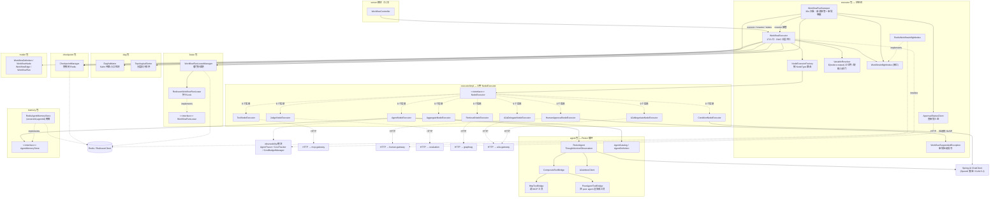

```mermaid
graph TD
    %% ================= 入口 / REST =================
    subgraph REST["server 模块（入口）"]
        WC[WorkflowController]
    end

    %% ================= 编排核心 =================
    subgraph ORCH["executor 包 — 状态机"]
        WE["WorkflowExecutor<br/>1721 行 · DAG 分层并行"]
        NEF["NodeExecutorFactory<br/>按 NodeType 路由"]
        VAR["VariableResolver<br/>${node:x:output} 占位符 / 缺输入闸门"]
        SWP["WorkflowRunSweeper<br/>30s 扫描：崩溃接管 + 审批唤醒"]
        ASC["ApprovalStatusClient<br/>查审批三态"]
        SUSP["WorkflowSuspendedException<br/>审批挂起信号"]
        WII["WorkflowInflightIndex (接口)"]
        RWII["RedisWorkflowInflightIndex"]
    end

    %% ================= 节点执行器族 =================
    subgraph EXEC["executor/impl — 9 种 NodeExecutor"]
        NEX["&lt;&lt;interface&gt;&gt; NodeExecutor"]
        TOOL["ToolNodeExecutor"]
        AGENT["AgentNodeExecutor"]
        COND["ConditionNodeExecutor"]
        AGG["AggregateNodeExecutor"]
        HUM["HumanApprovalNodeExecutor"]
        JUDGE["JudgeNodeExecutor"]
        RETR["RetrievalNodeExecutor"]
        DELEG["A2aDelegateNodeExecutor"]
        NEG["A2aNegotiateNodeExecutor"]
    end

    %% ================= DAG =================
    subgraph DAG["dag 包"]
        VAL["DagValidator<br/>Kahn 环路/入口检测"]
        SORT["TopologicalSorter<br/>分层拓扑排序"]
    end

    %% ================= 租约 =================
    subgraph LEASE["lease 包"]
        LM["WorkflowRunLeaseManager<br/>看门狗续期"]
        LEASEI["&lt;&lt;interface&gt;&gt; WorkflowRunLease"]
        RL["RedissonWorkflowRunLease<br/>持 RLock"]
    end

    %% ================= 检查点 =================
    subgraph CP["checkpoint 包"]
        CPM["CheckpointManager<br/>快照到 Redis"]
    end

    %% ================= ReAct 子系统 =================
    subgraph REACT["agent 包 — ReAct 循环"]
        RA["ReActAgent<br/>Thought/Action/Observation"]
        CAT["AgentCatalog / AgentDefinition"]
        CLOSE["CompositeToolBridge"]
        HTTPB["HttpToolBridge<br/>调 MCP 工具"]
        PEER["PeerAgentToolBridge<br/>把 peer agent 渲染成工具"]
        INBOX["A2aInboxClient"]
    end

    subgraph MEM["memory 包"]
        MEMI["&lt;&lt;interface&gt;&gt; AgentMemoryStore"]
        RMEM["RedisAgentMemoryStore<br/>(sessionId,agentId) 隔离"]
    end

    %% ================= 模型 =================
    subgraph MODEL["model 包"]
        DEF["WorkflowDefinition / WorkflowNode<br/>WorkflowEdge / WorkflowRun"]
    end

    %% ================= 外部边界 =================
    REDIS[("Redis / RedissonClient")]
    OBS["observability 模块<br/>AgentTracer / CostTracker / CostBudgetManager"]
    GW_MCP["HTTP → mcp-gateway"]
    GW_HUMAN["HTTP → human-gateway"]
    GW_EVAL["HTTP → evaluation"]
    GW_GRAG["HTTP → graphrag"]
    GW_A2A["HTTP → a2a-gateway"]
    LLMMODEL["Spring AI ChatClient<br/>(OpenAI 兼容 / GLM-5.2)"]

    %% ================= 依赖边 =================
    WC -->|execute / resume / status| WE

    WE --> NEF
    WE --> VAR
    WE --> VAL
    WE --> SORT
    WE --> CPM
    WE --> LM
    WE --> WII
    WE -.timeline.-> OBS
    WE --> DEF

    NEF --> NEX
    NEX -.->|9 个实现| TOOL & AGENT & COND & AGG & HUM & JUDGE & RETR & DELEG & NEG

    %% Sweeper 与 Executor 互指（真实循环依赖）
    SWP --> LM
    SWP --> CPM
    SWP --> WII
    SWP --> ASC
    SWP -->|resume 接管| WE

    %% 执行器各自的下游
    AGENT --> RA
    AGENT --> CAT
    AGENT --> MEMI
    AGENT -.-> OBS
    COND --> LLMMODEL
    TOOL -.HTTP.-> GW_MCP
    HUM -->|挂起抛 SUSP| SUSP
    HUM -.HTTP.-> GW_HUMAN
    JUDGE -.HTTP.-> GW_EVAL
    RETR -.HTTP.-> GW_GRAG
    DELEG -.HTTP.-> GW_A2A
    NEG -.HTTP.-> GW_A2A
    ASC -.HTTP.-> GW_HUMAN

    %% ReAct 内部
    RA --> CLOSE
    RA --> LLMMODEL
    RA --> INBOX
    CLOSE --> HTTPB
    CLOSE --> PEER

    %% 实现关系
    RWII -.->|implements| WII
    RL -.->|implements| LEASEI
    LM --> RL
    RMEM -.->|implements| MEMI

    %% Redis 落地
    CPM -.-> REDIS
    LM -.-> REDIS
    RWII -.-> REDIS
    RMEM -.-> REDIS
```
